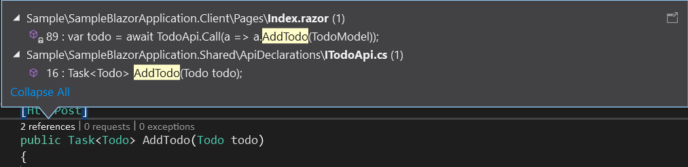

# RpcLikeBlazor

RpcLikeBlazor is a lightweight library for method like calling  server-side ASP.NET Api from client-side app.
> If something allow to use C# code in our app then we can make some magic :wink:.

## Pros
<a name="pros"></a>

<details>
<summary>Give you a great experience</summary>

```C#
SomeApi.Call(api => api.ApiMethod());
```
</details>

<details>
<summary>Easy to use</summary>

```C#
[Inject]
ApiCaller<ISomeApi> SomeApi { get; set; }

or

[Inject]
ApiService Api { get; set; }
```
</details>

<details>
<summary>...and setup</summary>

```C#
public static Task Main(string[] args)
{
  var builder = WebAssemblyHostBuilder.CreateDefault(args);
  builder.RootComponents.Add<App>("app");
  builder.UseRpcLikeBlazor(new ApiServiceSettings
  {
      ApiInterfacesSources = new List<IApiInterfacesSource>
      {
          new ApiInterfaceAttributeSource(typeof(ISomeApi).Assembly),
      },
  });
  return builder.Build().RunAsync();
}
```
</details>

<details>
<summary>Interface-first programming</summary>

```C#
[ApiInterface]
public interface ITodoApi
{
    [ApiHttpMethod(Method.Get)]
    Task<IEnumerable<Something>> GetSomething();

    [ApiHttpMethod(Method.Post)]
    Something AddSomething(Something todo);

    [ApiHttpMethod(Method.Delete)]
    void AddTodo(Something todo);
}
```
</details>

<details>
<summary>You always know where all the api controllers methods are called</summary>


</details>
...and other


## Getting Started

First of all, you need a Blazor WebAssembly project. It is the hardest thing to do :smile:. RpcLikeBlazor supports `netstandard2.1`.

### Installing

- Install RpcLikeBlazor NuGet package to your `Blazor.Shared` project.

### Configuring

- Configure your `Blazor.Client` project with
  ```C#
  builder.UseRpcLikeBlazor();
  ```
  ...in `Program.cs` file if you want to inject `ApiService`. And if you want to inject `ApiCaller` (see [pros](#pros)) then provide `ApiServiceSettings` with `ApiInterfacesSources` configured.

### Using

- Inject `ApiService` in client where you need and use:
  ```C#
  ApiService.Of<ISomeApi>.Call(api => api.ApiMethod());
  ```
- ...or inject already configured for you `ApiCaller<ISomeApi>` (if you provided source for `ISomeApi` in `ApiServiceSettings.ApiInterfacesSources`).

For additional knowledges download a sample from [GitHub](#other) and play with it.

### How to run sample

You need to run the client-side and server-side projects. For both projects: go to a folder with the `.csproj` file and run `dotnet run` command.

### Additional info

I recommend you to provide `ApiServiceSettings.ApiInterfacesSources` for all the Api Interfaces. There are checks for different conventions and if you violate them human readable exception will be thrown on the configuring stage.

You can configure your own converting of requests and responces parameters by providing `IObjectConverter` service in the client-side app.

### Conventions

- There is a maximum one complex (any `class` or complex `struct` exclude `enum`, `string`, `DateTime`, `Guid` and `double`) parameter in an Api Interface method. The complex parameter will be written in a request body and other parameters in a query string.
- There are no methods equals by their name and `ApiHttpMethod` attribute in Api Interface.

## License

This project is licensed under the MIT License - see the [LICENSE.md](LICENSE.md) file for details

## Other
<a name="other"></a>
- Project on GitHub: [RpcLikeBlazor](https://github.com/mpodreshetnikov/RpcLikeBlazor)
- NuGet package: [RpcLikeBlazor](https://www.nuget.org/packages/RpcLikeBlazor/)
- Author: [Maxim Podreshetnikov](https://github.com/mpodreshetnikov)
